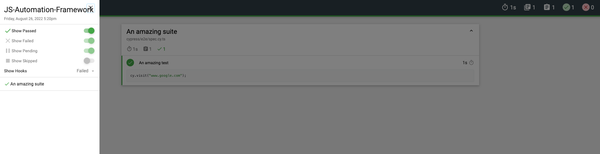

# Automation Framework made with TS + Cypress

## The project 💻

A *Cypress* template to create new automation framework projects!

## Tools ⚙️

* *Cypress v10.3.1*.
* *cypress-mochawesome-reporter v3.2.0*.
* *TypeScript v4.7.4*.
* *GitHub Actions*.
* *Docker*.

## Main project structure 🗂️

```
.
├── .github/
│   └── workflow/
│       └── main.yml
├── cypress/
│   ├── e2e/
│   │   ├── spec.cy.ts
│   ├── fixtures/
│   │   └── fixture.json
│   ├── support/
│   │   ├── commands.ts
│   │   ├── e2e.ts
│   │   └── index.ts
│   └── tsconfig.json
├── cypress.config.ts
├── cypress.env.json
├── Dockerfile
└── package.json
```

## Setup 🛠️

The following steps can be executed using a terminal (I use [hyper](https://hyper.is/)), or using the terminal provided by VS Code.

1. Clone the repo on your computer at any path you want.-

```bash
> git clone https://github.com/ArCiGo/JS-Automation-Framework.git

> git checkout master
```

2. In the path you cloned the repo, open the project folder and install the packages.-
```bash
> cd JS-Automation-Framework

> npm i
```

3. Delete the folders, files or branches you don't need.

## Run the tests ⚡
```bash
# If you don't want to open the Cypress GUI, you can execute the following commands:
> npm run cypress:open:cli
# or
> npm run html-report

# If you want to open the GUI:
> npm run cypress:open
```

When you run the tests, a new folder is generated inside the `cypress` folder (`reports`). This folder contains the report for the executed tests. If a test fails, the report will include a screenshot to see what the failure was.



## Docker 🐋

If you want to execute the tests using Docker, you can do the following in your terminal at the workspace project.-

```bash
# Without a Dockerfile

# Pull the Cypress Docker image you need to run the tests. You can use the latest one
> docker pull cypress/included:9.4.1

# Execute the following command to see the info of the image
> docker run -it --entrypoint=cypress cypress/included:9.4.1 info

# Then, execute the following command to run the tests inside of the container
> docker run -it -v $(pwd):/e2e -w /e2e cypress/included:9.4.1 --spec cypress/e2e --browser electron
```

```bash
# With a Dockerfile

# Execute the following command to compile the file. <YourVersionTag> may be any value you want
> docker build -t my-cypress-image:<YourVersionTag> .

# Then, execute the following command to run the tests inside of the container
> docker run -i -v $(pwd):/my-cypress-project -t my-cypress-image:<YourVersionTag> --spec cypress/e2e
```

You can check in this repository a couple of samples made with [JS](https://github.com/ArCiGo/JS-Automation-Framework/tree/AutomationFrameworkSample_JS) and [TS](https://github.com/ArCiGo/JS-Automation-Framework/tree/AutomationFrameworkSample_TS).

## Collaborations 👨‍🏭

Do you want to collaborate or contribute in this project? No problem! I'm open to improvements, comments and suggestions. Just do a PR with your suggestions and we can discuss them 😀